# Step-1
Step-1ではVPCを作成し、WordpressがインストールされたAMIを用いてEC2インスタンスを起動します。

## 概要図

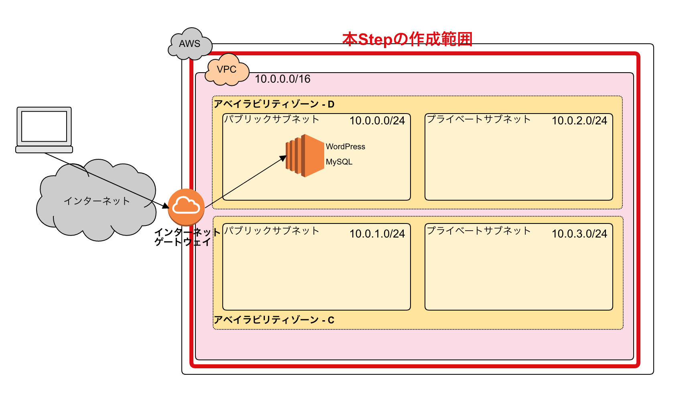

----

## Question VPCとは
これから作成するAmazon VPC(Amazon Virtual Private Cloud)について調べてみましょう(10分)

## VPCの作成
**実際にVPCを作成してみましょう。まずはサービスタブを選択しVPC管理ページを開きましょう**


----

**下にスクロールしVPCを選択します**


----

**VPCウィザードの開始を選択します**


----

**「ステップ1:VPC設定の選択」では「1個のパブリックサブネットを持つVPC」タブから選択ボタンを押下**


----

**「ステップ2:1個のパブリックサブネットを持つVPC」では以下を入力しVPCの作成ボタンを押下**

**VPC名: vpc-ユーザ名(例 vpc-user05 )**  
**アベイラビリティゾーン: ap-northeast-1d**  


----

**「VPCが正常に作成されました」ではOKボタンを押下**


----

**「VPCダッシュボード」では直下の「VPCでフィルタリング」でユーザ名を入力しフィルタリングしましょう。以下の例ではuser05でフィルタリングしています**


----

**作成したVPCの設定が正しいかVPCタブをクリックし内容を確認しましょう**

**名前: vpc-ユーザ名**  
**IPv4 CIDR: 10.0.0.0/16**  

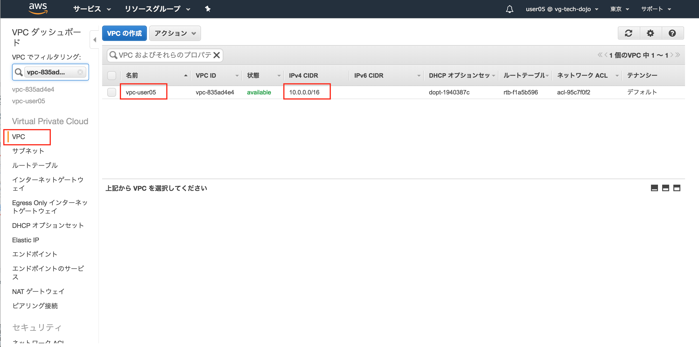

----

**ウィザードで作成したサブネットを確認しましょう。VPC作成ウィザードでは、VPC自体と一緒に1つ目のサブネットも作成されます。**

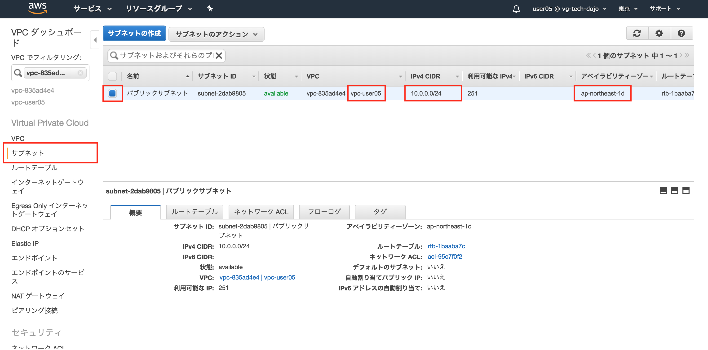

----

**作成したサブネットのRoute Tableを確認しましょう。VPCのネットワークアドレス 10.0.0.0/16 のターゲットがlocalに、デフォルトルートの 0.0.0.0/0 のターゲットがインタネットゲートウェイ(igw-XXXX)になっており、インターネットと通信できる設定になっています。**
 


----

## サブネットの追加作成

**作成したVPCに対して追加でサブネットを加えましょう。ここではサブネットの3つ作成を行いましょう**


----
**1から4を以下を参考に設定しましょう。**

|-|1 名前タグ|2 VPC|3 アベイラビリティ ゾーン|4 CIDR ブロック|
|:-|:-|:-|:-|:-|
|2つ目|パブリックサブネット|自分で作成したVPCを指定|ap-northeast-1c|10.0.1.0/24|
|3つ目|プライベートサブネット|自分で作成したVPCを指定|ap-northeast-1d|10.0.2.0/24|
|4つ目|プライベートサブネット|自分で作成したVPCを指定|ap-northeast-1c|10.0.3.0/24|


----
**全てのサブネットを確認しましょう。4つ作成され赤枠の内容が設定通りか確認しましょう。その際にIPv4でソートすると見易いです。**


----
**パブリックサブネット(10.0.1.0/24)のルートテーブルを変更しましょう。パブリックサブネット(10.0.1.0/24)を選択しルートテーブルタブを選択、編集ボタンを押下**


----
**現在使用しているルートテーブル以外にもう一つ選択できるはずです。そちらを選択し保存ボタンにて保存しましょう。選択するとインターネットゲートウェイの設定が追加されます。**

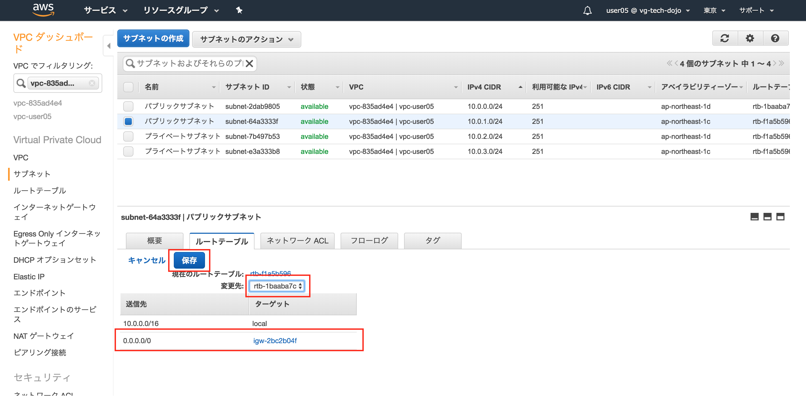

----

## EC2インスタンスの作成
**ここでは10.0.0.0のパブリックサブネット内にEC2インスタンスを作成します。サービスタブからEC2を選択**


----
**Webサーバの作成を行いましょう。インスタンスの作成ボタンを押下**


----
**マイAMIタブ、「1Day-AMI」の選択ボタンを押下**

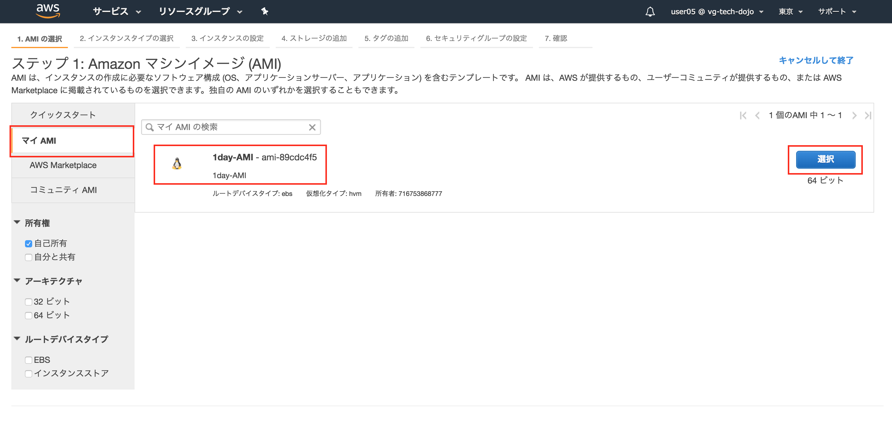

----
**t2.microを選択、次の手順：インスタンスの詳細の設定を押下**

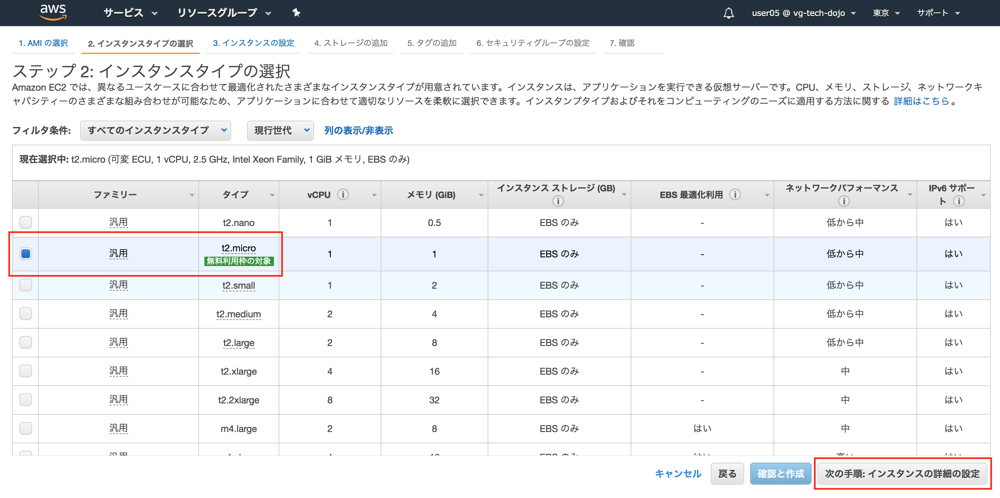

----
**ネットワークには自分が作成したVPCを選択、サブネットは10.0.0.0/24(ap-noatheast-1d)のパブリックサブネットを選択、自動割り当てパブリックIPは有効化を選択し、次の手順：ストレージの選択を押下**

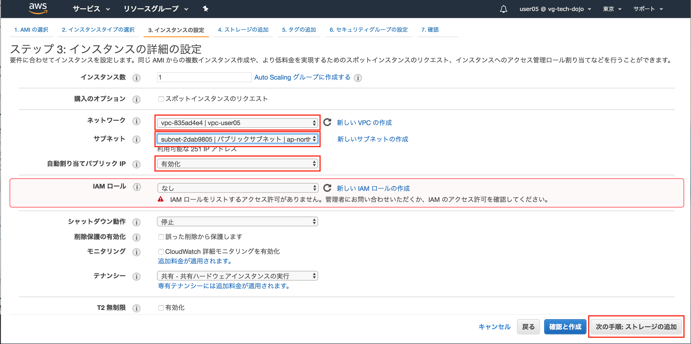

----
**ストレージの選択では特に何もせず、次の手順：タグの追加を押下**

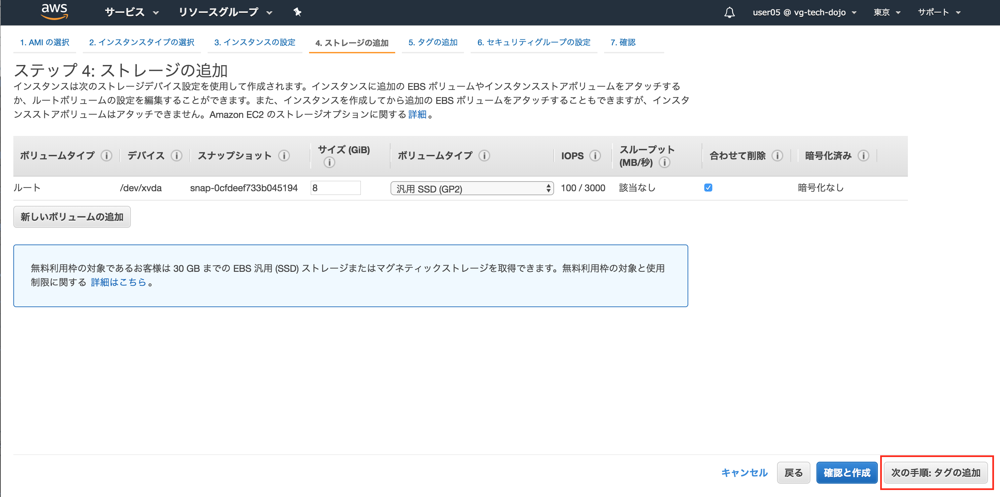

----
**タグの追加を押下**

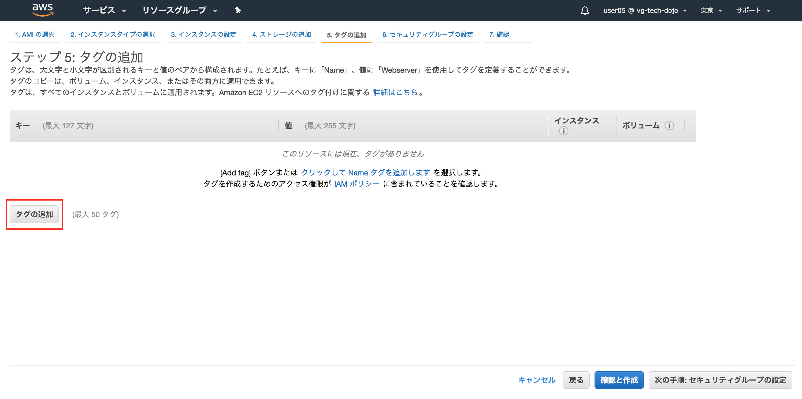

----
**キーに「Name」、値に「webserver#1-ユーザ名 例 webserver#1-user05 」を設定し次の手順：セキュリティグループの設定を押下**

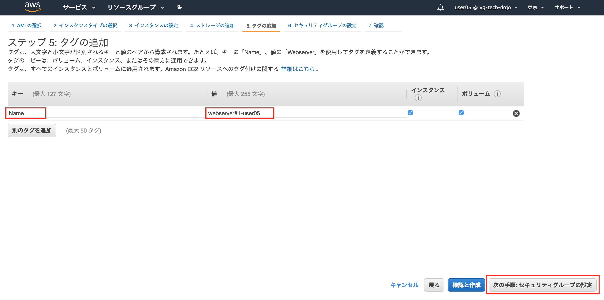

----
**新しいセキュリティグループを作成するを選択、セキュリティグループ名は「web-ユーザ名 例 web-user05」を設定、説明も「web-ユーザ名 例 web-user05」を設定し、ルールの追加ボタンを押下**


----
**タイプはHTTPを選択、送信元は任意の場所を選択し確認と作成のボタンを押下**

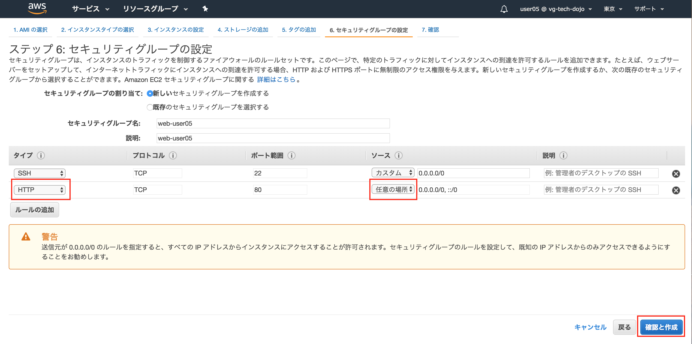

----
**画面下にスクロールさせ作成を押下**

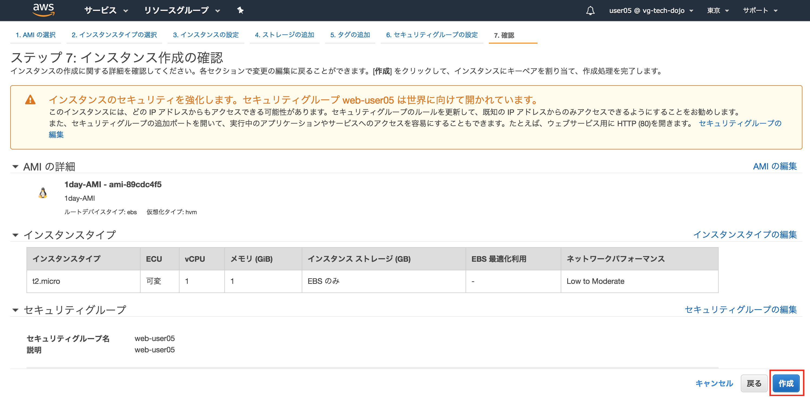

----
**EC2サーバにSSH接続する際に使用する秘密鍵を取得します。新しいキーペアの作成を選択、キーペア名は「1day-ユーザ名 例 1day-user05」を設定し、キーペアのダウンロードを押下、ダウンロードが成功したらインスタンスの作成ボタンを押下**


----
**EC2インスタンスが作成開始されました。インスタンスの表示ボタンを押下**

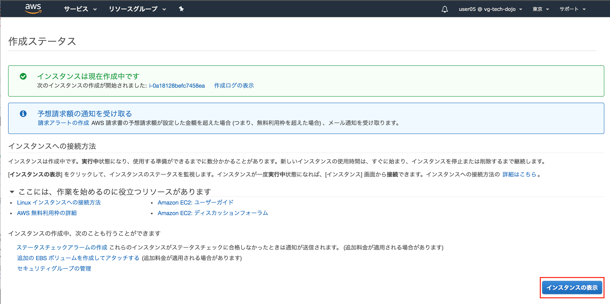

----
**作成したEC2インスタンスにて赤枠で囲った「パブリックDNS(IPv4)」の値をコピーしましょう。サーバログインのドメイン、サンプルアプリケーションであるWordpressのURLとなります。**


----

## Question AMIとは
今回AMIを使用してEC2インスタンスを作成しました。このAMIについて調べてみましょう(10分)

## サーバログイン
**作成したEC2インスタンスにログインし環境の確認をしましょう。`1day-userXX.pem`は各自が作成した秘密鍵、ec2-XXXXXX.comは「パブリックDNS(IPv4)」の値です。「ec2-user@ip-10-0-0-XX」のプロンプトが返れば成功です**

```
$ chmod 600 1day-userXX.pem
$ ssh -i 1day-userXX.pem -o StrictHostKeyChecking=no ec2-user@ec2-XXXXXX.com
[ec2-user@ip-10-0-0-65 ~]$
```

**MySQLにrootユーザで接続し、所有しているデータベースの確認をしてみましょう**

**パスワードは`wordpress`**

```
$ mysql -u root -p
Enter password:

mysql> show databases;
+--------------------+
| Database           |
+--------------------+
| information_schema |
| mysql              |
| performance_schema |
| test               |
| wordpress          |
+--------------------+
5 rows in set (0.00 sec)
```

## Question
1.このサーバに振られたIPアドレスの確認をしましょう。  
2.このサーバのデフォルトゲートウェイを確認しましょう。

## Wordpressの初期設定
**「パブリックDNS(IPv4)」の値でブラウザを開きましょう。Wordpressのサイトが開けば作成成功です。初期設定では「日本語」を選択し続けるボタンを押下**

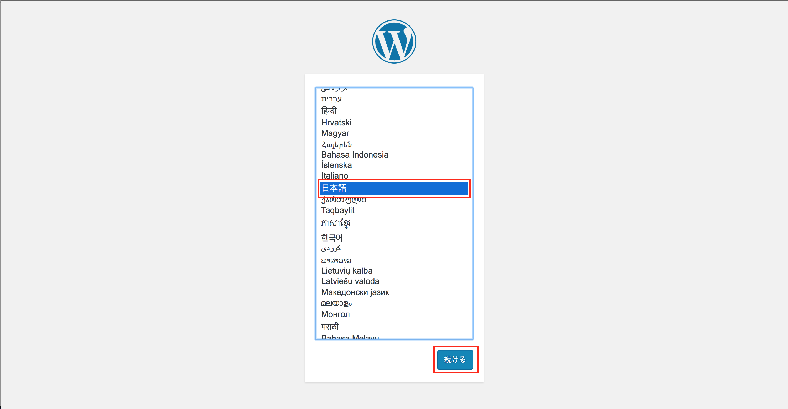

----
**「さあ、始めましょう」を押下**

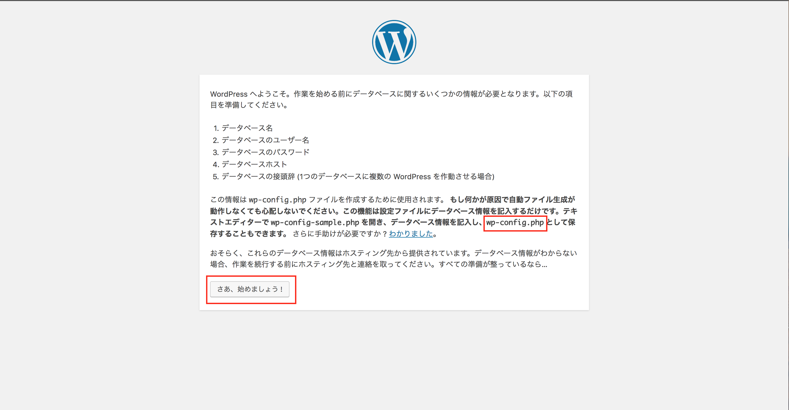

----
**データベース名、ユーザ名、パスワードを以下の設定値にしましょう。その他の値はデフォルトのままで問題ありません。設定をしたら送信ボタンを押下**

|項目|設定値|
|:-|:-|
|データベース名|wordpress|
|ユーザ名|admin|
|パスワード|wordpress|
|データベースのホスト名|localhost|
|テーブル接頭辞|wp_|

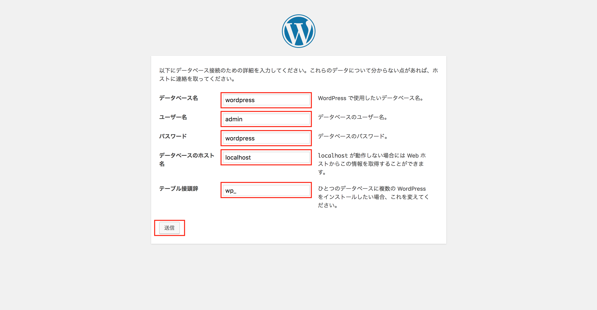

----
**インストール実行を押下**


----
**サイトのタイトル、ユーザ名、パスワード、メールアドレスを設定しましょう。パスワードは生成された値をメモなどに残しましょう。検索エンジンでの表示はチェックをしインデックスされない設定を有効にしましょう。**

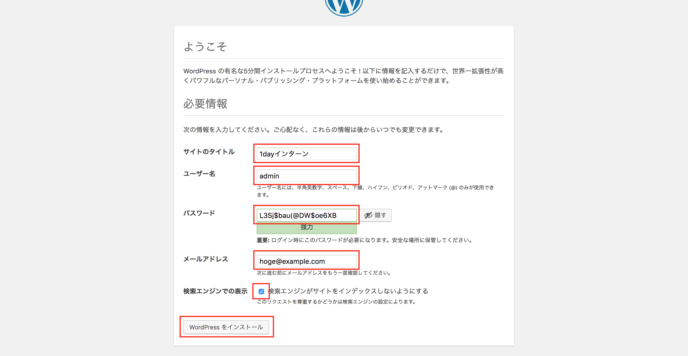

----

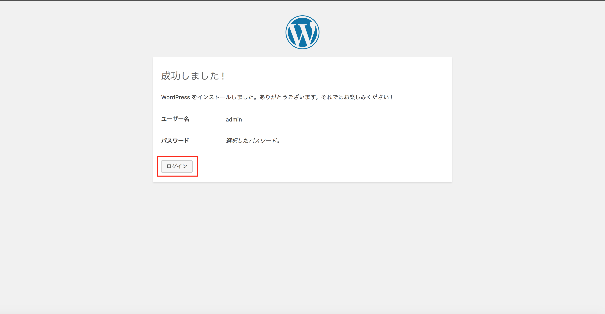

----
**ここまでの設定が間違いないか、ユーザ、パスワードを設定しログインしましょう**

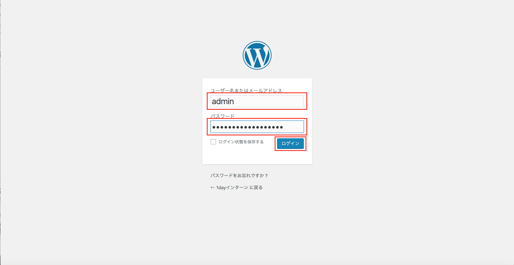

----
**管理画面にログインできれば設定完了です**

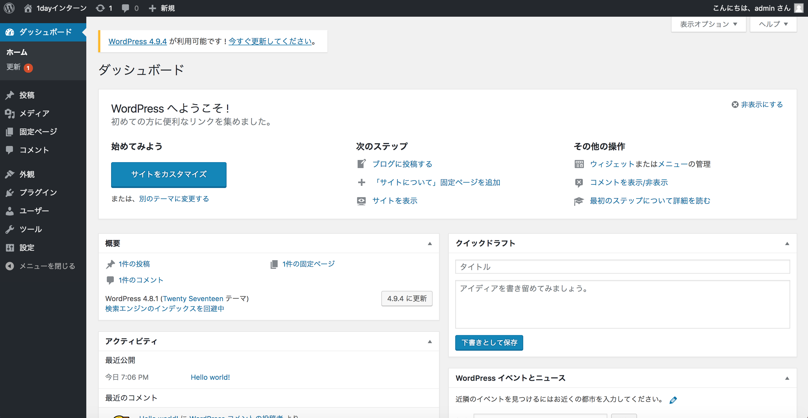

----
**「パブリックDNS(IPv4)」の値でブラウザを開きましょう。Wordpressのサイトが開けば設定完了です**

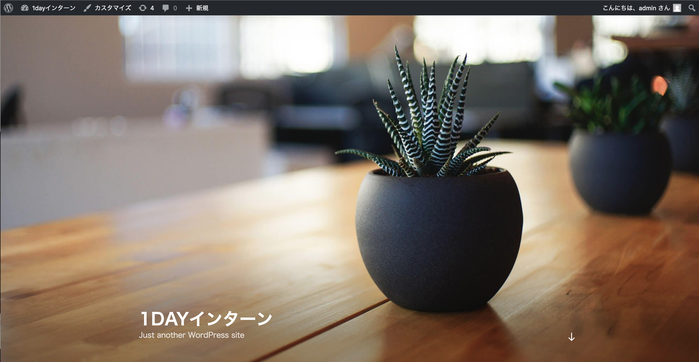

----

**ここまでのオペレーションでStep1は完了です！**
