# Step-3
Step-3ではWebサーバとアプリケーションレイヤの水平分散、データベースレイヤの冗長化を行います。具体的にはStep-2の環境にロードバランサを配置しEC2インスタンスを2つのアベイラビリティゾーンに水平分散、プライベートサブネットに配置されたデータベースAuroraを同様に2つのアベイラビリティゾーンに配置(MultiA-Z構成)し冗長構成とします。

## Question 水平分散とは
水平分散について調べてみましょう(10分)

## Question MultiA-Zとは
AWS MultiA-Zについて調べてみましょう(10分)

## AuroraをMultiA-Z構成に変更
**サービスからRDSを選択**


----


----


----


----

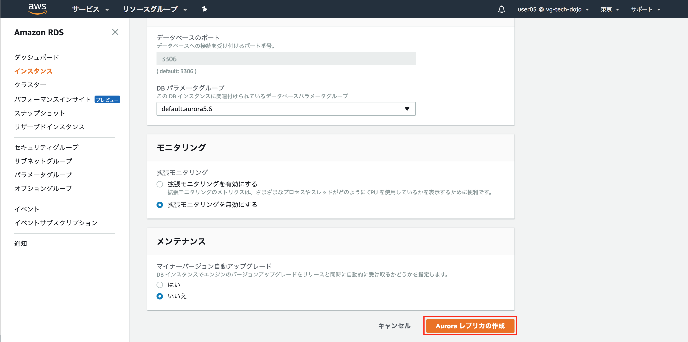

----
**約5分ほどでAuroraのレプリカは作成されます。画面中央上のリロードボタンを押して「利用可能」になるまで待ちましょう**


----

## Auroraクラスターの確認

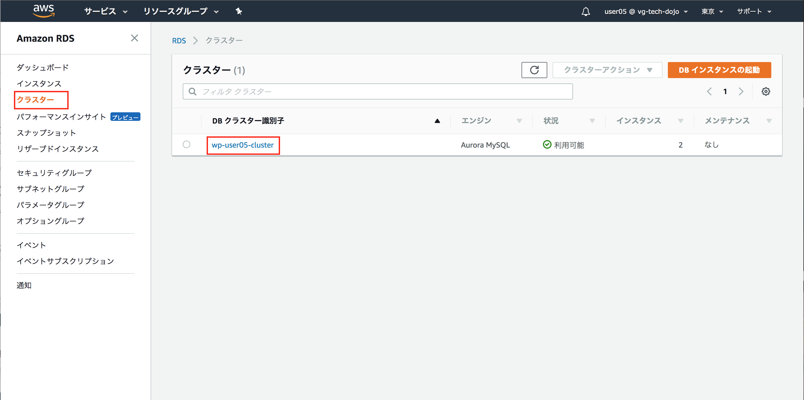

----
**クラスターエンドポイント、読み込みエンドポイントの確認をしましょう**

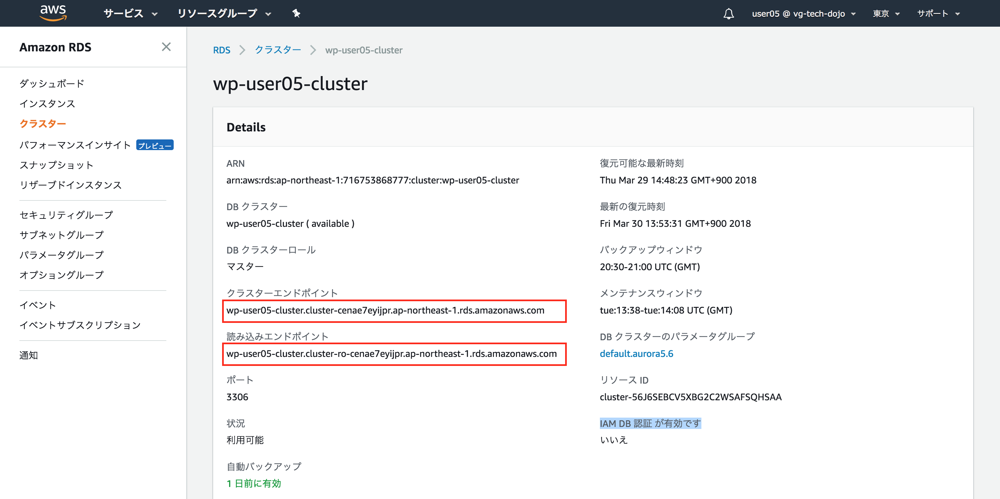

----

## 接続確認
**EC2サーバにSSH接続し、EC2サーバからAuroraに接続してみましょう。また作成したAuroraインスタンスが意図したセグメントに配置されているかも確認しましょう。**

```
$ ssh -i 1day-userXX.pem -o StrictHostKeyChecking=no ec2-user@ec2-XXXXXX.com
[ec2-user@ip-10-0-0-65 ~]$
```

**クラスタエンドポイントを使用してAuroraに接続しましょう。読み書きの権限についても確認しましょう。**

**注意 wp-userXX-cluster.cluster-cenae7eyijpr.ap-northeast-1.rds.amazonaws.comは各自のクラスタエンドポイントに直すこと。パスワードはAurora作成時に設定した内容を指定すること**

```
$ mysql -u admin -p -hwp-user05-cluster.cluster-cenae7eyijpr.ap-northeast-1.rds.amazonaws.com

mysql> select @read_only;
+------------+
| @read_only |
+------------+
| NULL       |
+------------+
1 row in set (0.00 sec)

mysql> exit
```

**続いてネットワークセグメントの確認(クラスタエンドポイント)をしましょう**

```
$ nslookup wp-user05-cluster.cluster-cenae7eyijpr.ap-northeast-1.rds.amazonaws.com
Server:     10.0.0.2
Address:    10.0.0.2#53

Non-authoritative answer:
wp-user05-cluster.cluster-cenae7eyijpr.ap-northeast-1.rds.amazonaws.com canonical name = wp-user05.cenae7eyijpr.ap-northeast-1.rds.amazonaws.com.
Name:   wp-user05.cenae7eyijpr.ap-northeast-1.rds.amazonaws.com
Address: 10.0.2.226
```

**読み込みエンドポイントを使用してAuroraに接続しましょう。読み書きの権限についても確認しましょう。**

**注意 wp-userXX-cluster.cluster-ro-cenae7eyijpr.ap-northeast-1.rds.amazonaws.comは各自の読み込みエンドポイントに直すこと。パスワードはAurora作成時に設定した内容を指定すること**

```
$ mysql -u admin -p -hwp-userXX-cluster.cluster-ro-cenae7eyijpr.ap-northeast-1.rds.amazonaws.com

mysql> select @read_only;
+------------+
| @read_only |
+------------+
| NULL       |
+------------+
1 row in set (0.01 sec)

mysql> exit
```

**続いてネットワークセグメントの確認(読み込みエンドポイント)をしましょう**

```
$ nslookup wp-user05-cluster.cluster-ro-cenae7eyijpr.ap-northeast-1.rds.amazonaws.com
Server:     10.0.0.2
Address:    10.0.0.2#53

Non-authoritative answer:
wp-user05-cluster.cluster-ro-cenae7eyijpr.ap-northeast-1.rds.amazonaws.com  canonical name = wp-user05-slave.cenae7eyijpr.ap-northeast-1.rds.amazonaws.com.
Name:   wp-user05-slave.cenae7eyijpr.ap-northeast-1.rds.amazonaws.com
Address: 10.0.3.217
```

## 系切り替え
**冗長構成となったAuroraのクラスタ〜エンドポイントを切り替えてみましょう。**

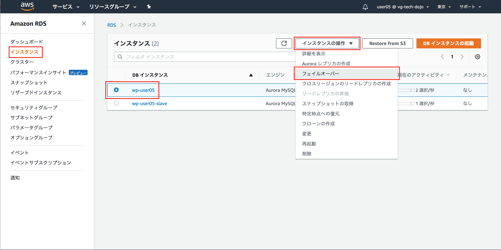

----
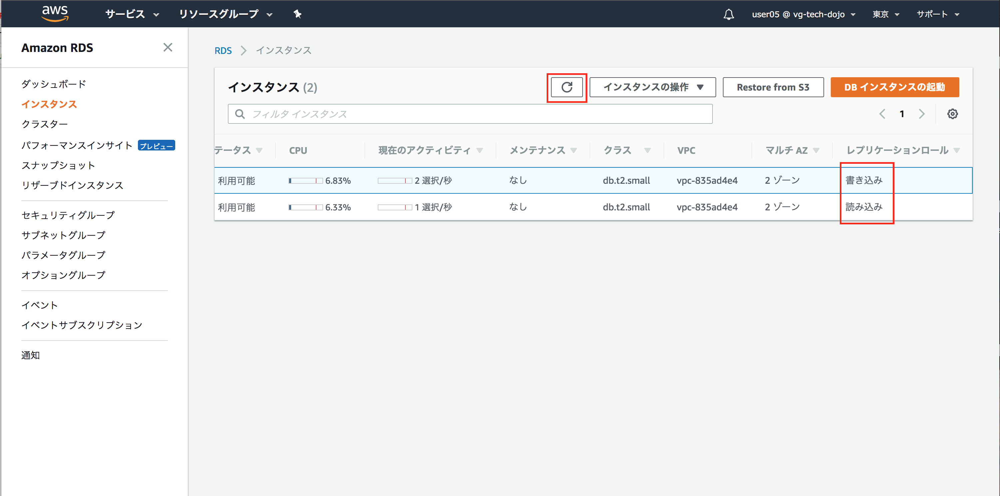

----


----


----

**ネットワークセグメントの確認(クラスタエンドポイント)をしましょう**

```
$ nslookup wp-user05-cluster.cluster-cenae7eyijpr.ap-northeast-1.rds.amazonaws.com
Server:     10.0.0.2
Address:    10.0.0.2#53

Non-authoritative answer:
wp-user05-cluster.cluster-cenae7eyijpr.ap-northeast-1.rds.amazonaws.com canonical name = wp-user05-slave.cenae7eyijpr.ap-northeast-1.rds.amazonaws.com.
Name:   wp-user05-slave.cenae7eyijpr.ap-northeast-1.rds.amazonaws.com
Address: 10.0.3.217
```

**続いてネットワークセグメントの確認(読み込みエンドポイント)をしましょう**

```
$ nslookup wp-user05-cluster.cluster-ro-cenae7eyijpr.ap-northeast-1.rds.amazonaws.com
Server:     10.0.0.2
Address:    10.0.0.2#53

Non-authoritative answer:
wp-user05-cluster.cluster-ro-cenae7eyijpr.ap-northeast-1.rds.amazonaws.com  canonical name = wp-user05.cenae7eyijpr.ap-northeast-1.rds.amazonaws.com.
Name:   wp-user05.cenae7eyijpr.ap-northeast-1.rds.amazonaws.com
Address: 10.0.2.226
```

## WebサーバのAMIを作成
**ここではWebサーバの水平分散にて必要となるEC2サーバのAMIを作成しましょう。AMIを作成することでここまでEC2サーバに設定した内容など全て反映された状態(Auroraの接続情報等)で水平分散が可能になります。**

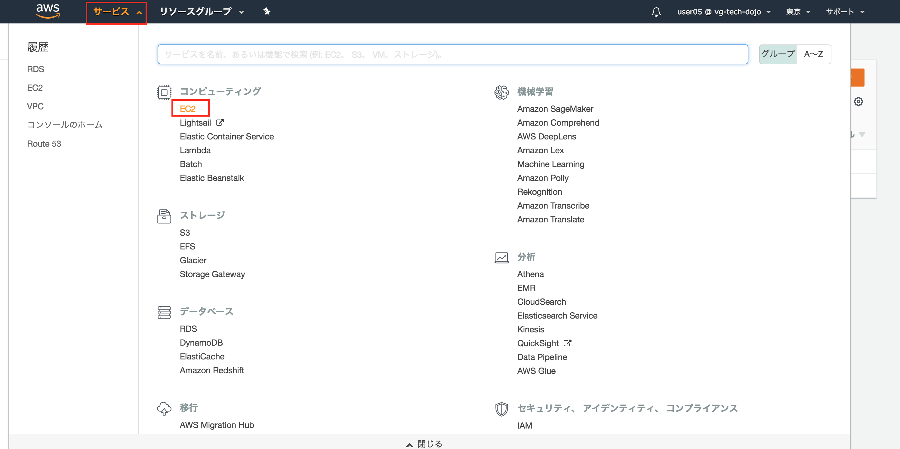

----


----


----
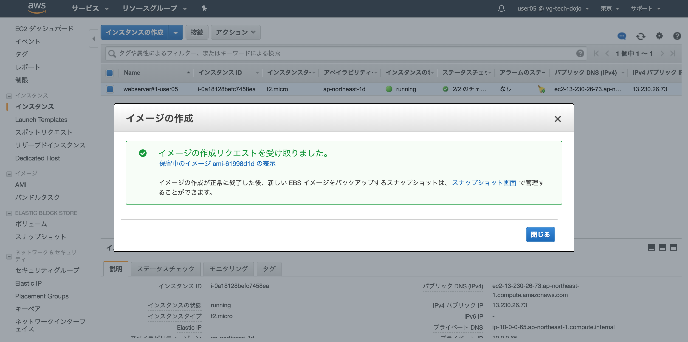

----
**数分で作成が完了します**


----

## 2台目のEC2インスタンスの作成(水平分散準備)

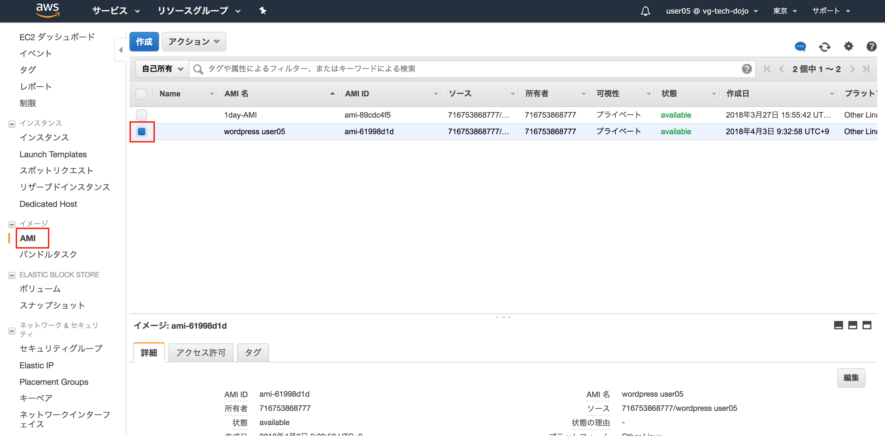

----
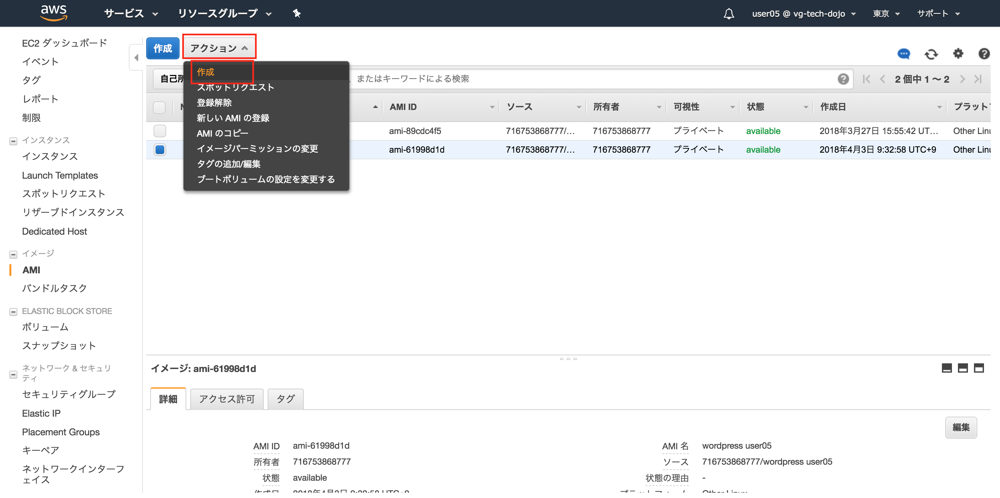

----


----
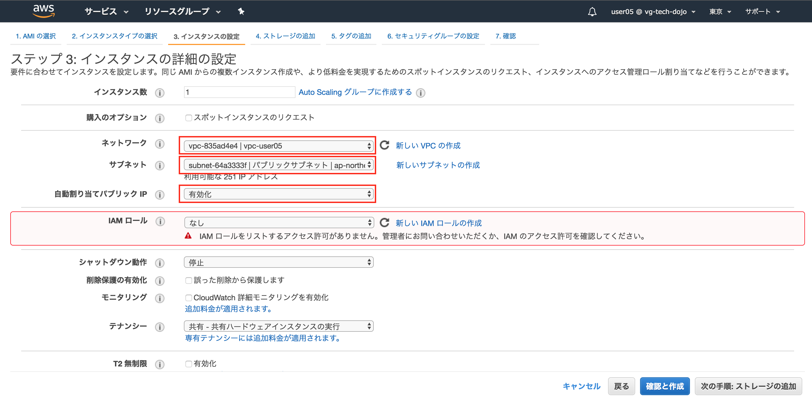

----
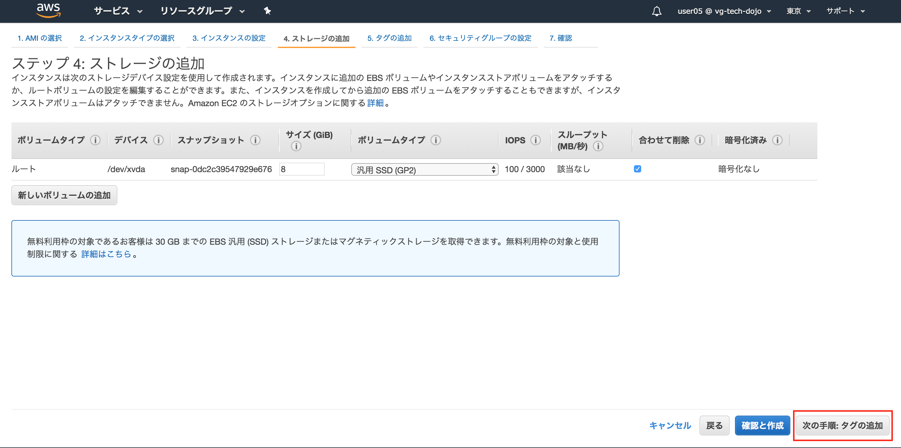

----
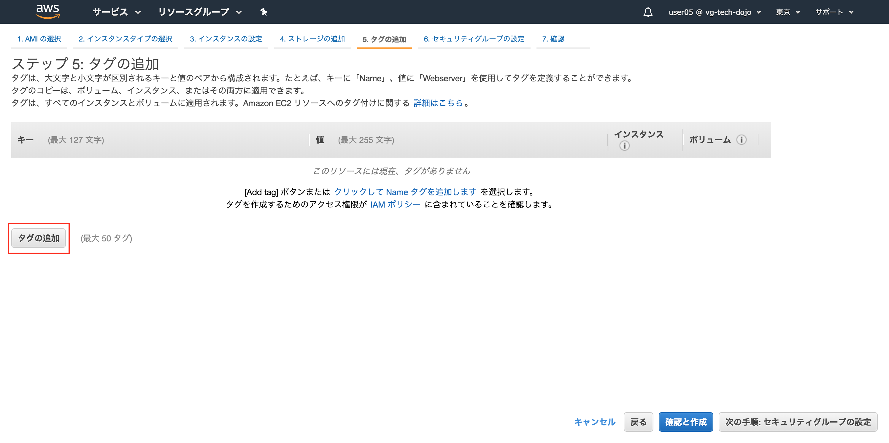

----
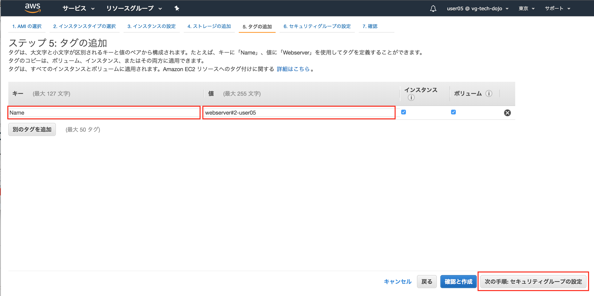

----
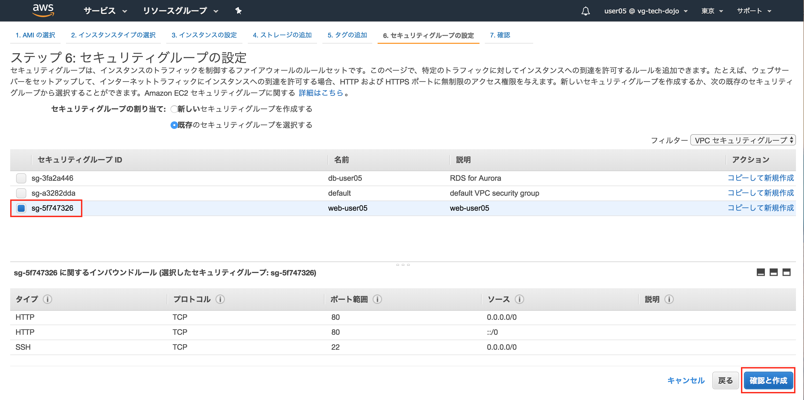

----


----


----
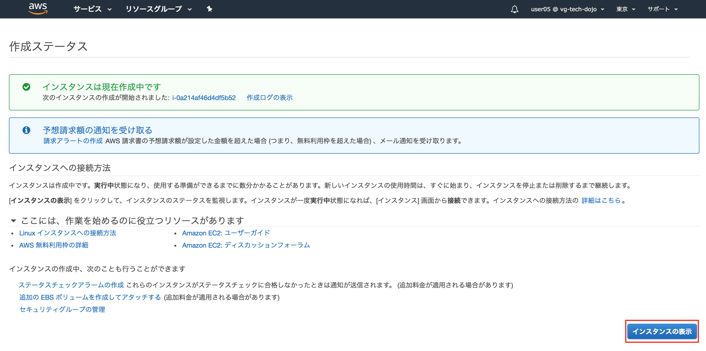

----
**作成完了まで数分掛かります**


----
**パブリックDNS(IPv4)のあたいを確認しブラウザでWordpressが参照できるか確認しましょう**

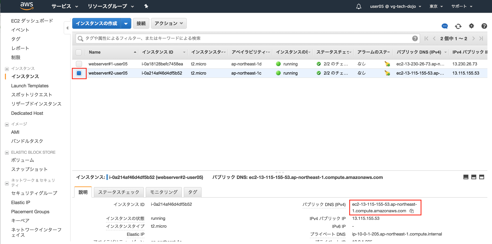

----
**Wordpressが表示されれば成功です**


----

## ELB(ALB)の作成
**ここでは作成した2台のEC2インスタンスの前段にアクセスを振り分けるELB(ALB)の作成を行います**

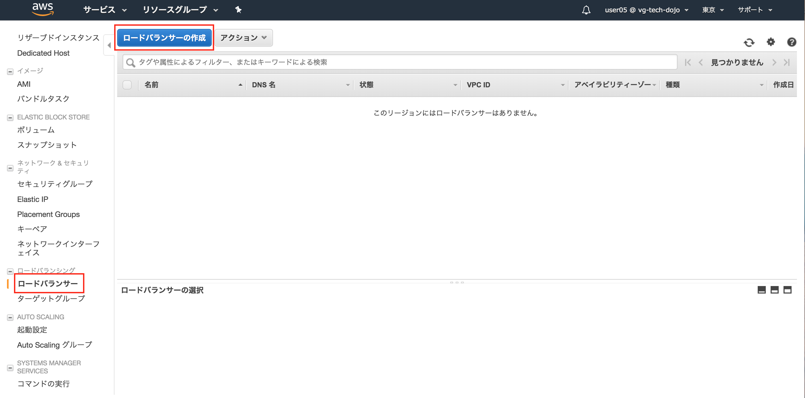

----
